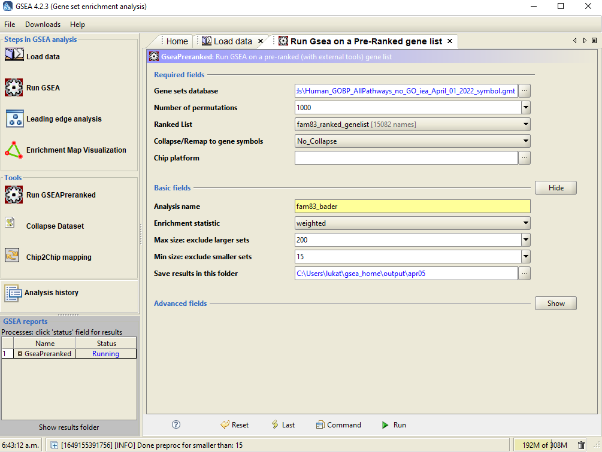
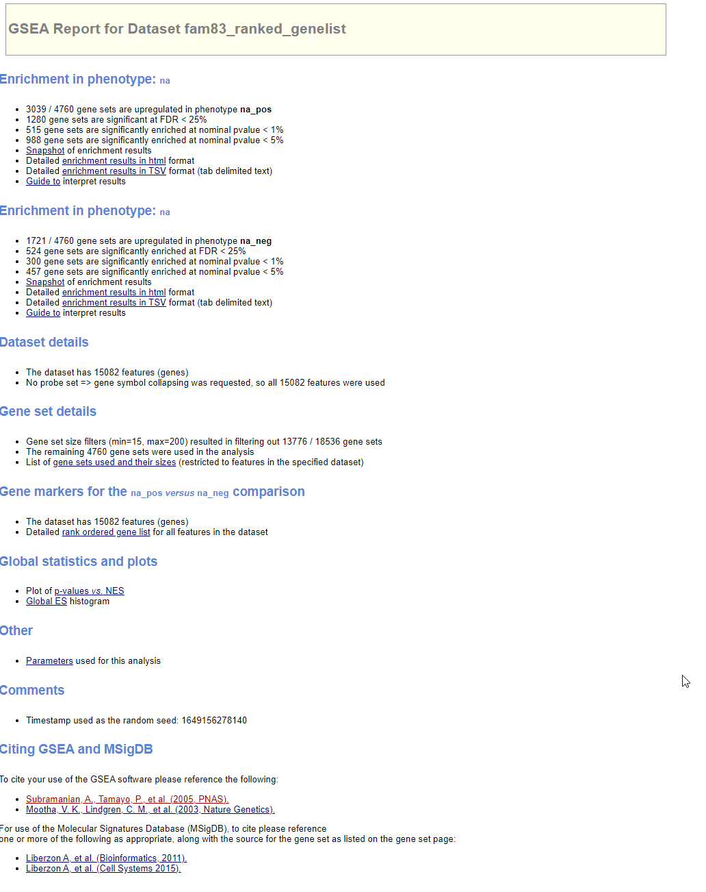
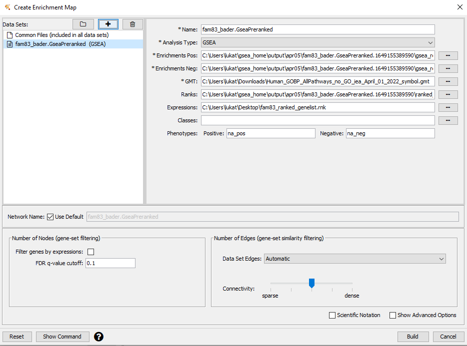
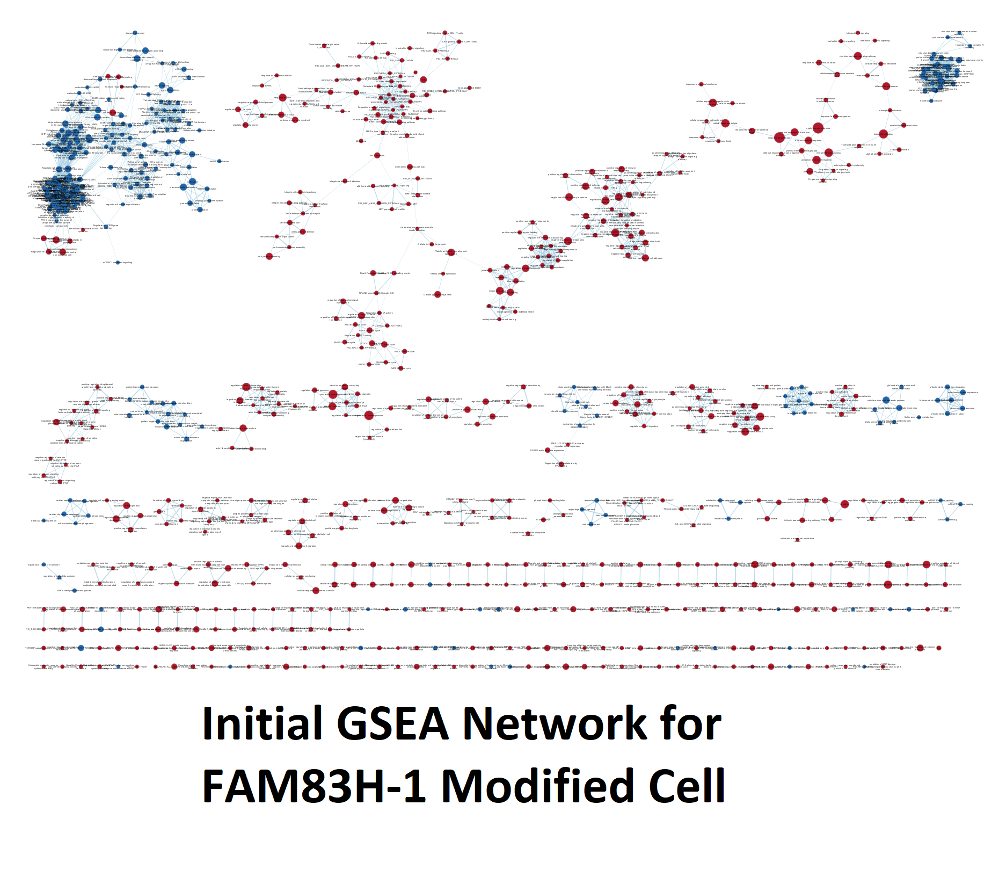
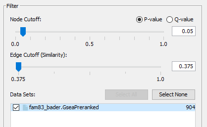
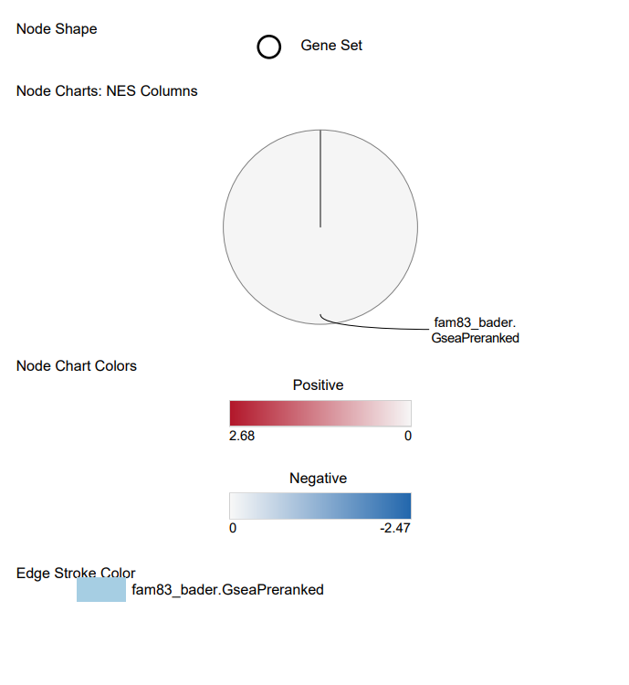
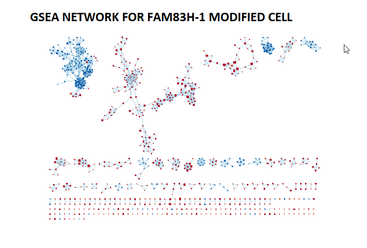
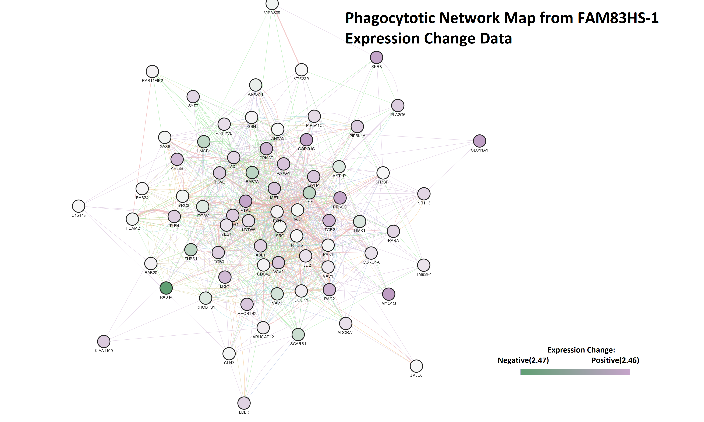
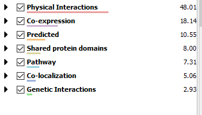

## Introduction
For ease of use, I wanted to include a link to my journal entry page that is
complementary to this R Notebook
[here](https://github.com/bcb420-2022/Luka_Trkla/wiki/%238---Assignment-3).
My expression data set utilized in this report is
[GSE159559](https://www.ncbi.nlm.nih.gov/geo/query/acc.cgi?acc=GSE159559) which
is a data set that may have therapeutic significance for treating 
adenocarcinoma, a form of cancer formed in the glands surrounding
organs. Adenocarcinoma often metastasizes, dramatically decreasing patient's 
likelihood of recovery. The experiment posits that FAM83H‐AS1, a noncoding 
driver of oncogenesis, might potentially be a therapeutic target for lung 
adenocarcinoma. The experiment provides 3 negative controls for A549 human 
cells, followed by down regulated A549 cells for FAM83H‐AS1, in hopes of 
showing that FAM83H-AS1 inhibits lung adenocarcinoma apoptosis.

**Geo ID Used to Download Data:** GSE159559

**The Organism:** Human

**Number of GEO Data Sets That use the Same Technology:** 327

**Number of GEO Samples that use this Technology:** 5113

**Number of Genes Available Prior to Filtering:** 40173

**Standard for Filtering:** Remove features without at least 1 read per million 
in the 3 replicates.

**Number of Genes Available After Filtering:** 15082

**Method used for Normalization** Trimmed Mean of M-values

**Multiple Hypothesis Testing Method** Benjamini-Hochberg method

**P-Value Utilized** 0.05

**Thresholded Analysis Platform** G-Profiler

## Non-Thresholded Gene Set Enrichment Analysis
Using the ranked list of genes from assignment 2, I performed a non-thresholded
gene set enrichment analysis, using GSEA (GSEA, in reference). 
I used the following inputs to run my GSE 
analysis.

#

Note that 1000 initial permutations are run from our ranked gene list, with 
a minimal size of 15 and maximal size of 200. I initially ran the GSEA using
a default gene set from GSEA, but I decided to use the Bader gene set after
having lackluster results with my network. Specifically, I used 

HUMAN_GOBP_AllPathways_no_GO_iea_April_01_2022_symbol .gmt

(Bader, in reference.)
Below is a generic resulting page from running the GSEA, for overview information
from it.

#

It found that 3039 gene sets were upregulated, with 1280 gene sets showing
significant FDR (<25%), and 1721 gene sets that were downregulated, with 
524 genes showing significant FDR (<25%). The proportions between the non-thresholded
GSEA analysis and the thresholded G-profiler analysis done in the previous assignment
can be compared as follows (in a qualitative way). Their proportion of upregulated
genes are in both analysis' are significantly greater than the downregulated genes
(from FAM83HS-AS1 silencing), but the most striking difference is that non-thresholded
analysis contributed many more gene sets (and genes) than the thresholded one, which
produced 1906 upregulated genes and 802 downregulated genes. This makes sense if
you understand that the purpose of the non-thresholded gene analysis is to allow 
for many signals that came from genes that weren't significantly over or under
expressed to emerge. Of course, this comparison is not as straightforward as
with GSEA as we are engaging directly with gene sets rather than directly with the 
manipulations we did with genes in G:Profiler.

## Visualizing GSEA IN CYTOSCAPE
Immediately below, I insert the parameters used for making a non-thresholded gene
set enrichment network, prior to any sort of manipulation:

#

The initial resulting map is shown here:

#

The resulting network has 904 nodes with 5032 edges, with the following thresholds
(to make the network not overly populated.) 

#

They were annotated using the defaults
that EnrichmentMap applied to them, and were treated with a radial heatmap utilizing
the following constraints, shown in the legend below for the publication ready 
figure:

#

Here is the publication ready figure:

#

## Interpretation
Perhaps I should have raised the threshold for entry (solely on the network) because
there is a multitude of competing themes present. Of note though, there are two
massive themes present when analyzing. Massively upregulated connections pertaining to 
actin regulation and the change in regulation (usually upregulated) for nodes that
pertain to the regulation of factors being produced for cell replication. As 
FAM83H‐AS1 is posited to be a noncoding oncogenic driver, which makes sense that
pathways involving cell replication would be upregulated (Wang, in references).
To add, FAM83H‐AS1is posited to be inhibitory towards apoptosis, so its silencing
massively influencing the actin that produce the cytoskeleton is in line with our
expectations. There is an article published in Nature (Campbell, in references).
That suggests that actin cytoskeleton is a key regulator for apoptosis, which 
is in line with the original research statement that FAM83H-AS1 potentially
inhibits cell apoptosis. Of course, this would need more thorough focused research
to interogate. Overall, our research here is in line with the expectations the initial
research article outlines; that FAM83H-AS1 has significant potential to be an 
therapeutic target for lung cancer.

## Specific pathway
A gene of interest, RAB14, is discussed in the article (Wang, in references), 
as a potential therapeutic targets for lung adenocarcinoma, as it is an 
oncogene that were down-regulated in the cells silenced for FAM83H-AS1. The 
article never goes into depth as to why these are oncogenes of interest or 
what they might be involved with. I found in the network group pertaining to
phagocytosis that RAB14 was collected in and well-connected to many other genes 
in the set. It is the most significantly down-regulated gene pertaining to 
phagocytosis, shown below, annotated using log-fold expression value changes:

#

Here we can see the plurality of interactions in the network come from physical interactions

#

The reason for investigating phagocytosis are two; RAB14 is the only gene experiencing
significant downregulation in silenced FAM83H-AS1 cells, and more importantly, the 
processes of phagocytosis and apoptosis are related, albeit rather tenuously (L-P Erwig, in references.)
Perhaps RAB14 has an influence on phagocytotic cells that would target the cancer-ridden
cells, but that is just a thought and would really need more followup to examine.

## References
Bader:
  Enrichment Map: A Network-Based Method for Gene-Set Enrichment Visualization and Interpretation
  Merico D, Isserlin R, Stueker O, Emili A, Bader GD
  PLoS One. 2010 Nov 15;5(11):e13984
  
Campell:
  Gourlay, C., Ayscough, K. The actin cytoskeleton: a key regulator of apoptosis and ageing?. Nat Rev Mol Cell Biol 6, 583–589 (2005). https://doi.org/10.1038/nrm1682

Cytoscape:
  Institute for Systems Biology, 2019. Cytoscape, Available at: https://www.cytoscape.org.

GSEA:
  Subramanian, Tamayo, et al. 2005 Proc Natl Acad Sci U S A 102(43):15545-50

L-P Erwig:
  Erwig, LP., Henson, P. Clearance of apoptotic cells by phagocytes. Cell Death Differ 15, 243–250 (2008). https://doi.org/10.1038/sj.cdd.4402184

Wang:
  Wang, S., Han, C., Liu, T., Ma, Z., Qiu, M., Wang, J., You, Q., Zheng, X., Xu, W., Xia, W., Xu, Y., Hu, J., Xu, L.,     & Yin, R. (2021). FAM83H-AS1 is a noncoding oncogenic driver and therapeutic target of lung adenocarcinoma.     Clinical and translational medicine, 11(2), e316. https://doi.org/10.1002/ctm2.316
