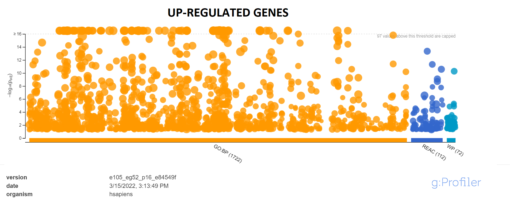
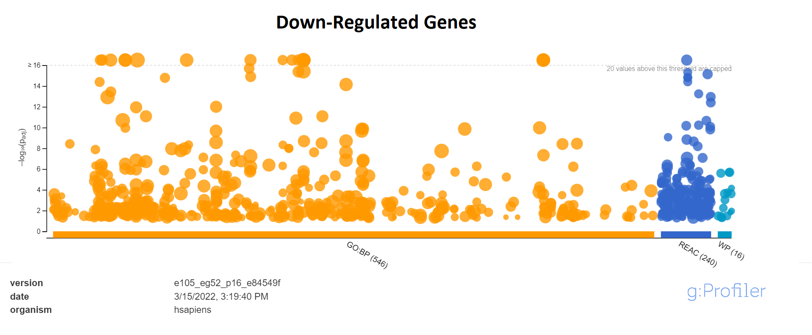
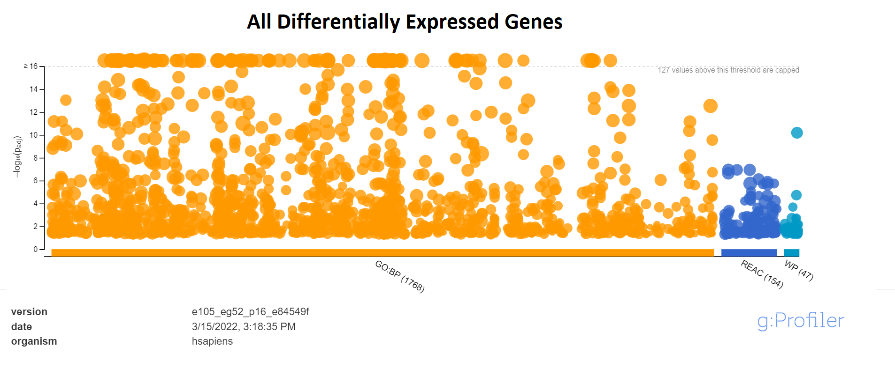

## Introduction
For ease of use, I wanted to include a link to my journal entry page that is
complementary to this R Notebook
[here](https://github.com/bcb420-2022/Luka_Trkla/wiki/%236---Assignment-2).
My expression data set utilized in this report is
[GSE159559](https://www.ncbi.nlm.nih.gov/geo/query/acc.cgi?acc=GSE159559) which
is a data set that may have therapeutic significance for treating 
adenocarcinoma, a form of cancer formed in the glands surrounding
organs. Adenocarcinoma often metastasizes, dramatically decreasing patient's 
likelihood of recovery. The experiment posits that FAM83H‐AS1, a noncoding 
driver of oncogenesis, might potentially be a therapeutic target for lung 
adenocarcinoma. The experiment provides 3 negative controls for A549 human 
cells, followed by down regulated A549 cells for FAM83H‐AS1, in hopes of 
showing that FAM83H-AS1 inhibits lung adenocarcinoma apoptosis. This journal
utilizes a normalized version of the expression data set, and below is a 
brief summary of results from this data set.

**Geo ID Used to Download Data:** GSE159559

**The Organism:** Human

**Number of GEO Data Sets That use the Same Technology:** 327

**Number of GEO Samples that use this Technology:** 5113

**Number of Genes Available Prior to Filtering:** 40173

**Standard for Filtering:** Remove features without at least 1 read per million 
in the 3 replicates.

**Number of Genes Available After Filtering:** 15082

**Method used for Normalization** Trimmed Mean of M-values

## Differential Gene Expression
Firstly, I want to download any prerequisite packages that I will need to work
on the data set, and load it into the library.
```{r, warning=FALSE}
# Here I download BiocManager only if it is unavailable prior.
if (!requireNamespace("BiocManager", quietly = TRUE))
  install.packages("BiocManager")
library(BiocManager)

# Here I download GEOmetadb only if it is unavailable prior.
if (!requireNamespace("GEOmetadb", quietly = TRUE))
  BiocManager::install("GEOmetadb")
library(GEOmetadb)

# Here I download edgeR only if it is unavailable prior.
if (!requireNamespace("edgeR", quietly = TRUE))
  BiocManager::install("edgeR")
library(edgeR)

#Dowload ComplexHeatMap
if (!require("BiocManager", quietly = TRUE))
    install.packages("BiocManager")

BiocManager::install("ComplexHeatmap")

```

The Normalized data this assignment utilizes is accessed under the variable 
name.: fam83_norm

```{r, echo=FALSE, error=FALSE, warning=FALSE}
# Getting the expression data for GSE159559.
supp_files = getGEOSuppFiles('GSE159559')
gse159 <- getGEO("GSE159559",GSEMatrix=FALSE)
# Grabbing expression data from data set.
fnames = rownames(supp_files)
fam83_exp = read.delim(fnames[1],header=TRUE, check.names = FALSE)
# Grabbing the identifiers used in the data for negative control and silenced
# data respectively.
sample_info <- data.frame(lapply(colnames(fam83_exp)[3:8],
    FUN=function(x){unlist(strsplit(x, split = "-"))[c(1,2)]}))
colnames(sample_info) <- colnames(fam83_exp)[3:8]
rownames(sample_info) <- c("cell_type", "sample_number")
sample_info <- data.frame(t(sample_info))
# Filtering out low counts. I used the method that was suggested by edgeR; to 
# remove features without at least 1 read per million in the 3 of our samples. 
# This is because the smallest group of replicates in my experiment is 3.
cpms = cpm(fam83_exp[,3:8])
rownames(cpms) <- fam83_exp[,1]
# Filtering low-occurrence entries to fam83_exp.
fam83_exp = fam83_exp[rowSums(cpms >1) >=3,]
# The provided Gene IDs from the data set are HUGO gene symbols, each of which is
# unique relative to the rest of the data set. Here I am just making the 
# row names correspond to the Gene Id the row pertains to.
rownames(fam83_exp) <- fam83_exp$GeneID

# Here I trim off geneType and geneID, to get the data.frame of the desired 
# result specified by the assignment.
fam83_exp <- subset(fam83_exp, select = -c(GeneID, GeneType))
d = DGEList(counts=as.matrix(fam83_exp[,1:6]), group=sample_info$cell_type)
# Calculates normalization factors, using TMM.
d = calcNormFactors(d, method="TMM")
# Grabbing the normalized data.
fam83_norm <- cpm(d) 
#converting to data.frame format.
fam83_norm <- as.data.frame(fam83_norm)
```

Prior to discussing which factors would be used in making a model design for the
differential expression analysis, it would be worthwhile to revisit the 
experimental design used to make the 
[dataset](https://www.ncbi.nlm.nih.gov/pmc/articles/PMC7882096/), as well as 
observing an MDS plot of the replicates.
```{r, echo=TRUE}
plotMDS(d, labels=rownames(sample_info), col = c("blue", "green")[factor(sample_info$cell_type)])
```
By the experimental design, we had 3 replicates in 2 conditions performed; 
3 negative controls for A549 human cells (labeled in blue as NC-#), followed by
down regulated A549 cells for FAM83H‐AS (labeled in green as Silence-#) .Our
Condition, the silencing of the gene, seems to have strong clustering, 
whereas out control has much greater distribution. This might suggest the
condition is powerful, as we are seeing strong separation. The experimental
design only outlines 1 differentiating variable between these 2 sets (whether
or not a gene of interest is down-regulated or not), unlike the lecture sample
where replicates were partitioned by cell type and by patient. At this stage, 
the MDSplot suggests that FAM83H-AS presence is a worthwhile factor for our
model design.

Below, we compute a generic differential expression, via a model we describe
immediately above. To do so, as was discussed in lecture, we have to produce
a valid matrix with pre-computed dispersion factor and normalization factors.
```{r}
#Producing a model matrix using each sample's cell_type
fam83_model_design_pat <- model.matrix(~ sample_info$cell_type)

# Estimate a dispersion value, which will be used for calculating the
# normalization factors used in our differential expression analysis.
d <- estimateDisp(d, fam83_model_design_pat)

# Calculating normalization factors
d <- calcNormFactors(d)

# Fit normalized factors and the model design we made
fam83_fit <- glmQLFit(d, fam83_model_design_pat)

# Calculating differential expression.
fam83_qlf.neg_vs_sil <- glmQLFTest(fam83_fit, coef='sample_info$cell_typeSilence')
# grab list of scored genes
fam83_qlf_output_hits <- topTags(fam83_qlf.neg_vs_sil,sort.by = "PValue",
                           n = nrow(fam83_norm))
```
Before proceeding, we should observe overview statistics on the differential
expression we just performed. Including how many genes were significantly
expressed, and were these genes up-regulated or down-regulated? The threshold I 
used is (from what I gather in BCB420 and BCH411 is a commonly used p-value) 
of 0.05. It is reasonably robust, but if I require a more stringent p value I 
can always decrease its value.

**How many gene pass the threshold p-value < 0.05?:** 
`r length(which(fam83_qlf_output_hits$table$PValue < 0.05))`

**How many genes pass correction?:** 
`r length(which(fam83_qlf_output_hits$table$FDR < 0.05))`

**How many genes are up regulated?:** 
`r length(which(fam83_qlf_output_hits$table$PValue < 0.05 
             & fam83_qlf_output_hits$table$logFC > 0))`

**How many genes are down regulated?:** 
`r length(which(fam83_qlf_output_hits$table$PValue < 0.05 
             & fam83_qlf_output_hits$table$logFC < 0))`

## Multiple Hypothesis Testing
Multiple hypothesis testing is an important factor to consider, considering
as we increase the number of trials, we don't want to incorrectly reject true
Null hypothesis when it occurs. Benjamini-Hochberg method helps decrease false
positives. Benjamini-Hochberg is a less stringent 
correction tool than the standard I am used to in statistics courses: 
Bonferonni, allowing for a comparatively increased amount of correct p-value
detection while not being too harsh and eliminating too many data points.
```{r}
fam83_exp_matrix <- as.matrix(fam83_norm)
fam83_minimalSet <- ExpressionSet(assayData=fam83_exp_matrix)
fam83_fit <- lmFit(fam83_minimalSet, fam83_model_design_pat)
bayes_fit <- eBayes(fam83_fit,trend=TRUE)
topfit <- topTable(bayes_fit,
                   coef=ncol(fam83_model_design_pat),
                   adjust.method = "BH",
                   number = nrow(fam83_exp_matrix))
output_hits <-merge(rownames(fam83_norm),
                    topfit,
                    by.y=0, by.x=1,
                    all.y=TRUE)
```

Let's check to see how the number of genes that pass threshold and correction
has changed:
```{r}
output_hits <- output_hits[order(output_hits$P.Value),]
# How many genes pass the threshold p-value < 0.05
length(which(output_hits$P.Value < 0.05))
# How many genes pass correction?
length(which(output_hits$adj.P.Val < 0.05))
```
Both are slightly more restrictive than the default method used above, prior to
Benjamini-Hochberg method being used.

By plotting a MA plot, we can observe how many of our genes are differentially
expressed. Of note, most of the data between the negative control and the 
silenced data is comparatively not too different, which is in line with the 
expectation the prof. suggested would be a common occurence. This makes sense, 
that the expression of most genes are not regulated by one gene. However, we can
see that the set has a considerable number of outliers. The number of 
down-regulated genes and up-regulated genes appears relatively balanced, which
is in line with our previous computation where we saw these values were
similar.
```{r}
plotMA(log2(fam83_norm[,c(1:3, 4:6)]), ylab="M - ratio log expression", 
       main="FAM83H-AS1 Negative Control vs Silenced",
       )

points(log2(sum(fam83_norm["RAB14",1:3]) / sum(fam83_norm["RAB14",4:6])),
  pch=24, col="cyan", cex=2)
points(log2(sum(fam83_norm["HNRNPK",1:3]) / sum(fam83_norm["HNRNPK",4:6])),
  pch=24, col="green", cex=2)
points(log2(sum(fam83_norm["RAB8B",1:3]) / sum(fam83_norm["RAB8B",4:6])),
  pch=24, col="red", cex=2)

legend("topright", inset=.02, title="Genes of Interest",
   c("RAB14","RAB8B","HNRNPK"), fill=c("cyan", "red", "green"), horiz=TRUE, cex=0.8)
```
There are 3 genes of interest outlined in the MA plot, that pertain to 3 genes
the article focuses on as potential therapeutic targets for lung adenocarcinoma.
HNRNPK is an RNA-binding protein that is shown to regulate the translation 
of cancer cells. It binds with FAM83H1-AS1 to regulate cell apoptosis. As the 
article notes, the expression in both the negative control and the silenced
version are not significantly changed, which we see with the green triangle in
the MA plot, which has a ratio log expression of approximately 0. 2 other genes
(RAB14 and RAB8B) which are oncogenes were shown to be down-regulated in the
silence (Or increased expression in negative control compared to silence),
which we observe with the red and green triangles.

Let's grab the top hits and heatmap them, to hopefully observe clustering.
```{r, echo=TRUE, error=FALSE, warning=FALSE}
library(ComplexHeatmap)
library(circlize)
heatmap_matrix <- as.matrix(fam83_norm)
fam83_top_hits <- output_hits$x[output_hits$P.Value<0.05]
fam83_heatmap_tophits <- t(scale(t(heatmap_matrix[
 which(rownames(heatmap_matrix) %in% fam83_top_hits),])))

if(min(fam83_heatmap_tophits) == 0){
 heatmap_col = colorRamp2(c( 0, max(fam83_heatmap_tophits)), 
 c( "white", "red"))
 } else {
 heatmap_col = colorRamp2(c(min(fam83_heatmap_tophits), 0,
 max(fam83_heatmap_tophits)), c("blue", "white", "red"))
 }

current_heatmap <- Heatmap(as.matrix(fam83_heatmap_tophits),
      column_title = "Heatmap for Top Hits in FAM83H-AS1",
      cluster_rows = TRUE,
      cluster_columns = FALSE,
      show_row_dend = TRUE,
      show_column_dend = TRUE, 
      col=heatmap_col,
      show_column_names = TRUE, 
      show_row_names = FALSE,
      show_heatmap_legend = TRUE,
      )
plot(current_heatmap)


```
Across the top hits, comparing the silenced replicates vs. the negative control, 
we can see strong similarities in gene expression between the silenced trials,
and separately strong similarities between the negative controls. To add, when
the gene is upregulated in either condition, we see a comparative 
down-regulation in the heatmap for the other condition, suggesting strong 
clustering.

## Threshold Over-Representaion Analysis
We want to produce significantly up-regulated and down-regulated set of genes
to run a threshold gene set enrichment analysis. 
```{r}
fam83_output_gn <- merge(rownames(fam83_norm), fam83_qlf_output_hits, by.x=1, by.y = 0)
length(fam83_output_gn)
fam83_output_gn[,"rank"] <- -log(fam83_output_gn$PValue,base =10) * sign(fam83_output_gn$logFC)
length(fam83_output_gn)
fam83_output_gn <- fam83_output_gn[order(fam83_output_gn$rank),]
length(fam83_output_gn)

# Produce the list of up-regulated genes
upregulated_genes <- fam83_output_gn$x[
  which(fam83_output_gn$PValue < 0.05 
             & fam83_output_gn$logFC > 0)]

# Produce the list of down-regulated genes
downregulated_genes <- fam83_output_gn$x[
  which(fam83_output_gn$PValue < 0.05 
             & fam83_output_gn$logFC < 0)]

# Output the 3 types of lists into .txt files for further threshold gene 
# set enrichment analysis.
write.table(x=upregulated_genes,
            file=file.path("fam83_upregulated_genes.txt"),sep = "\t",
            row.names = FALSE,col.names = FALSE,quote = FALSE)
write.table(x=downregulated_genes,
            file=file.path("fam83_downregulated_genes.txt"),sep = "\t",
            row.names = FALSE,col.names = FALSE,quote = FALSE)
write.table(x=data.frame(genename= fam83_output_gn$x,F_stat= fam83_output_gn$rank),
            file=file.path("fam83_ranked_genelist.txt"),sep = "\t",
            row.names = FALSE,col.names = FALSE,quote = FALSE)
```
Using these text files, I ran the thresholded gene set enrichment analysis on
the downregulated genes, up-regulated genes, and all differentially expressed
genes. I used G:Profiler's g:Gost method, as it allows for me to convieniently
select which biological pathways I wished to use and gene ontology, using 
a web interface, found [here.](http://biit.cs.ut.ee/gprofiler/gost). It also
allowed for me to continue using the p-value of 0.05, and the 
Benjamini-Hochberg method we outlined prior, all conveniently from a browser.
The vast majority of the gene ontology information came from GO:biological
process, which makes sense as a choice considering our data set pertains to
genes. Pathway information used Reactome and WikiPathways, which really was
choosing all pathways available, other than KEGG, because it is not free to
use. g:Profiler uses the most current versions available for annotative 
information, particularly from GO.
Below are the figures to showcase these results
#
We had 1906 genes return for up-regulated genes, the vast majority (1722) 
coming from GO:BP. 97 values above the threshold of 16 were observed.
#
We had 802 genes return for up-regulated genes, the vast majority (546) 
coming from GO:BP.20 values above the threshold of 16 were observed.
#
We had 1969 genes return for differntly expressed genes, 
the vast majority (1768) coming from GO:BP. 127 values above the threshold of
16 were observed.

In all 3 sets, we observe a similar proportion of annotations coming from
each source, GO:BP being most common across all 3. There is a higher amount
of data points over-represented in the up-regulated set compared to the 
down-regulated set. Further, the up-regulated genes have higher -log values 
than the down-regulated genes, observed in the figures having lower y values
on average in the down-regulated set compared to in the up-regulated set. The
figure containing all differentially expressed genes surprisingly doesn't 
deviate much from the other 2 figures, appearing as an additive version of the
prior two.

## Interpretation
Our over-representation results suggest strongly that FAM83H-AS1 could serve
as a therapeutic target for LUAD; we observed in the figure that when silenced,
subsequent genes in its pathway vary dramatically in expression in response.
Unfortunately, for the proposed genes it influences that the research paper
discusses in particular, RAB14, RAB8B, and HNRNPK, I could not find compelling
research to further support the claims made by the researchers. As the
original article was released relatively recently, this could suggest that this
research may be released soon, rather than no follow-up occuring.